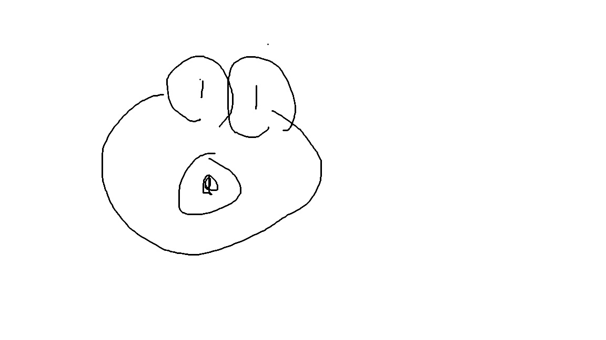

<a href="../">zakki</a>

<nav class="blog-nav">
  <a href="../About">about</a>
  <a href="../Sitemap">sitemap</a>
  <a href="../Tags">tags</a>
  <a href="../Archive">archive</a>
  <button class="theme-toggle" type="button" aria-label="toggle theme" onclick="window.zakkiToggleTheme && window.zakkiToggleTheme()">
    ☀
    ☾
  </button>
</nav>

<aside class="blog-sidebar">

<h3>ABOUT</h3>

漫画、ガジェット、ゲーム、PC、日々のメモなどを雑に置いていく個人ブログです。

<a href="../About">詳しく見る</a>

<h3>CATEGORY</h3>
<ul class="sidebar-category-list">
<li><a href="../Blog">Blog</a></li>
<li><a href="../漫画・創作">漫画・創作</a></li>
<li><a href="../PC・ガジェット">PC・ガジェット</a></li>
<li><a href="../Python">Python</a></li>
<li><a href="../ゲーム">ゲーム</a></li>
<li><a href="../レビュー">レビュー</a></li>
</ul>

<h3>TAGS</h3>

<a href="../tag-blog">#blog (3)</a>
<a href="../tag-memo">#memo (2)</a>
<a href="../tag-obsidian">#obsidian (3)</a>
<a href="../tag-test">#test (3)</a>

<h3>ARCHIVE</h3>
<ul class="sidebar-archive-list">
<li><a href="../Archive">2026-07 (1)</a></li>
<li><a href="../Archive">2026-06 (4)</a></li>
</ul>

</aside>

# テスト投稿

UPDATED: 2026.06.28

<figure class="post-hero-image">

</figure>

本文本文本文本文本文本文本文本文本文本文本文本文本文本文本文本文本文本文本文本文本文本文本文本文本文本文本文本文本文本文本文本文本文本文本文本文本文本文本文本文本文本文本文本文本文本文本文本文本文本文本文本文本文本文本文本文本文本文本文本文
本文本文本文本文本文本文本文

本文本文本文本文本文本文本文

<nav class="post-adjacent-nav" aria-label="post navigation">

<a href="../posts/%E3%81%AF%E3%81%98%E3%82%81%E3%81%A6%E3%81%AE%E6%8A%95%E7%A8%BF">Next: はじめての投稿</a>

<a href="../posts/%E7%94%BB%E5%83%8F%E3%81%AA%E3%81%97%E3%83%86%E3%82%B9%E3%83%88%E8%A8%98%E4%BA%8B">Previous: 画像なしテスト記事</a>

</nav>

© zakki

<a href="../">Home</a> / <a href="../Archive">Archive</a> / <a href="../Tags">Tags</a>

